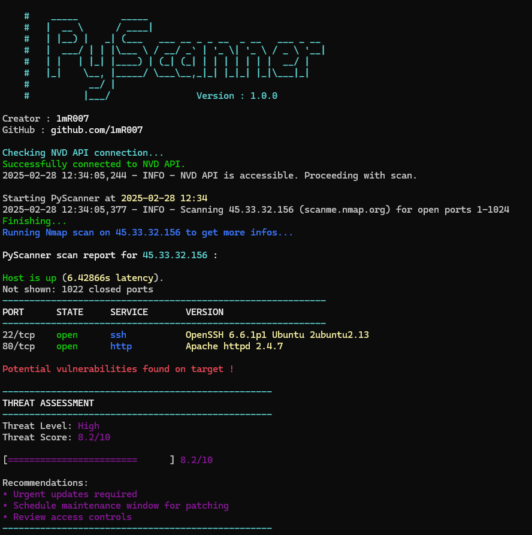

# PyScanner 🔍⚡
[](https://github.com/YourUsername/PyScanner) [](https://www.gnu.org/licenses/gpl-3.0.html)

A fast TCP port scanner written in Python, designed to be user-friendly while offering advanced features using the `python-nmap` library and the NVD API for vulnerability scanning.

## 🚀 Features

- 🔍 **Port Scanning**: Analyze open ports on a target.
- 🌍 **CIDR Scanning**: Discover hosts on a network using CIDR notation.
- 🛠️ **OS & Service Detection**: Identify active services.
- 🏷️ **Version Detection**: Option to extract service versions (`-sV`).
- 🔒 **Vulnerability Scanning**: Check detected services for known vulnerabilities (`-V`).
- 📊 **Threat Assessment**: Provides an overall threat level assessment based on found vulnerabilities.
- 📄 **Report Exporting**: Generate detailed reports in JSON or TXT format.
- ⚡ **Fast**: Uses threads & batch processing to speed up the scan.

## ⚠️ Responsible Usage

***PyScanner*** is intended for legal use by IT professionals. Ensure you have authorization before scanning a network. Malicious use of this tool is strictly prohibited, and you assume full responsibility for its usage.

## 🛠️ Installation

### 🐟 Prerequisites

- Python **3.7 or later**
- **Nmap** (required for some advanced options)
- Python dependencies (install with the command below):

```bash
git clone https://github.com/1mR007/PyScanner.git
cd PyScanner
python3 -m venv venv
source venv/bin/activate  # On Windows: venv\Scripts\activate
pip install -r requirements.txt
```

### ⚙️ Installing Nmap

| System | Command |
|----------|----------|
| **Debian/Ubuntu** | `sudo apt-get install nmap` |
| **CentOS/RHEL** | `sudo yum install nmap` |
| **macOS** | `brew install nmap` |
| **Windows** | [Install from nmap.org](https://nmap.org/) |

## 📌 Usage

| Option  | Description  | Example  |
|---------|-------------|----------|
| `-t` | Scan a target | `python.exe -m src.PyScanner -t scanme.nmap.org` |
| `-p` | Specify a port range (20-1000) | `python.exe -m src.PyScanner -t 192.168.1.1 -p 20-1000` |
| `-sV` | Detect service versions | `python.exe -m src.PyScanner -t 192.168.1.1 -sV` |
| `-V` | Check for vulnerabilities (requires -sV) | `python.exe -m src.PyScanner -t 192.168.1.1 -sV -V` |
| `-n` | Discover hosts on a network | `python.exe -m src.PyScanner -n 192.168.1.0/24` |
| `-Pn` | Scan without initial ping | `python.exe -m src.PyScanner -t 192.168.1.1 -Pn` |
| `--apikey` | Provide NVD API key for better rate limits | `python.exe -m src.PyScanner -t 192.168.1.1 -sV -V --apikey YOUR_API_KEY` |
| `--txt` | Export results to a TXT file | `python.exe -m src.PyScanner -t 192.168.1.1 --txt report.txt` |
| `--json` | Export results to a JSON file | `python.exe -m src.PyScanner -t 192.168.1.1 --json report.json` |


### 🔹 Examples

**Basic scan**:
```bash
python3 scanner.py -t <target>
```

**Scan with version detection**:
```bash
python3 scanner.py -t <target> -sV
```

**Complete vulnerability scan**:
```bash
python3 scanner.py -t <target> -sV -V
```

**Network scan with vulnerability assessment**:
```bash
python3 scanner.py -n 192.168.1.0/24 -sV -V
```

## 📝 Example Output

```
PyScanner scan report for 45.33.32.156 (scanme.nmap.org):

Host is up (0.22490s latency).
Not shown: 1022 closed ports
------------------------------------------------------------
PORT      STATE     SERVICE       VERSION
------------------------------------------------------------
22/tcp    open      ssh           OpenSSH 6.6.1p1 Ubuntu 2ubuntu2.13
80/tcp    open      http          Apache httpd 2.4.7

--------------------------------------------------
THREAT ASSESSMENT
--------------------------------------------------
Threat Level: High
Threat Score: 8.2/10

[========================      ] 8.2/10

Recommendations:
• Urgent updates required
• Schedule maintenance window for patching
• Review access controls
--------------------------------------------------

VULNERABILITY SUMMARY:
------------------------------------------------------------
Found 1 potential vulnerabilities across all services:
 • Critical: 0
 • High: 1
 • Medium: 0
 • Low: 0

TOP VULNERABILITIES:
1. [High] A crafted URI sent to httpd configured as a forward proxy (P...
   ID: CVE-2021-44224 | CVSS: 8.2

PyScanner done: 1 IP address (1 host up) scanned in 3.24 seconds
Detailed vulnerability information saved to 45.33.32.156_vulnerabilities.json
```

## 🖥️ Screenshot



## 📢 Notes

- ⚡ If the target does not respond, *PyScanner* will indicate that the host seems unreachable.
- 🚫 If the target blocks ICMP requests, using `-Pn` might help.
- 🛠️ Some advanced options require **Nmap**.
- 🔐 The NVD API has rate limits (5 requests per 30 seconds without an API key). For better performance, obtain an API key from [NVD](https://nvd.nist.gov/developers/request-an-api-key).

## 📚 Important Files

- `PyScanner.py` : Main scanner script.
- `src/utils/scanning.py` : Functions for port scanning, network discovery, and vulnerability scanning.
- `src/utils/data-classes.py` : Data structures for storing scan results.
- `src/utils/reporting.py` : Generates and exports scan reports (TXT, JSON).
- `src/ui/logging.py` : Configures logging, banners, and terminal output.
- `requirements.txt` : List of Python dependencies.
- `README.md` : This documentation file.

## 💡 NVD API

***PyScanner*** uses the National Vulnerability Database (NVD) API to check detected services for known vulnerabilities. 

The NVD API provides detailed information about vulnerabilities, including severity and potential impact. Note that the NVD API has rate limits (5 requests per 30 seconds without an API key). 

For better performance and higher rate limits, it is recommended to obtain an API key from [NVD](https://nvd.nist.gov/developers/request-an-api-key).


## 📝 License

This project is licensed under the **GPL v3**.